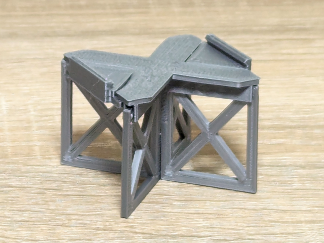

# Stand for Unitrack HO

Snap-fit stand for Kato Unitrack HO.

## How to build

Use OpenSCAD to build the model. Open the _stand.scad_ file with OpenSCAD, **render** it and **export as stl file**.

https://openscad.org/

Replace `all();` with `leg();`, `lower_stage();` and `upper_stage();` to export the parts separately.
